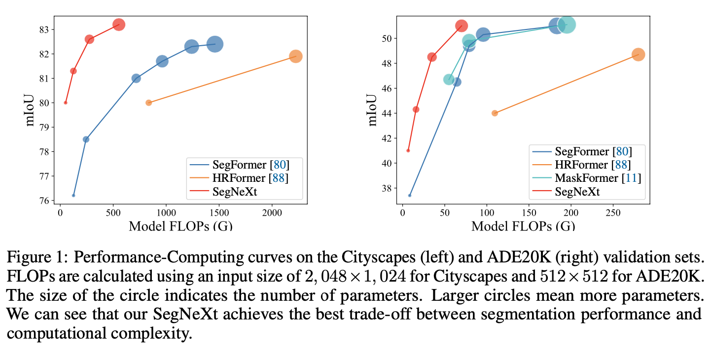

# SegNeXt: Rethinking Convolutional Attention Design for Semantic Segmentation (NeurIPS 2022)

The repository contains official Jittor implementations of training and evaluation codes and pre-trained models for [**SegNext**](). 

The paper is in [**Temp Link**](resources/paper.pdf).

**Notes**: ImageNet Pre-trained models can be found in Jittor Hub [mscan_t](https://cg.cs.tsinghua.edu.cn/jittor/assets/build/checkpoints/mscan_t.pkl),[mscan_s](https://cg.cs.tsinghua.edu.cn/jittor/assets/build/checkpoints/mscan_s.pkl), [mscan_b](https://cg.cs.tsinghua.edu.cn/jittor/assets/build/checkpoints/mscan_b.pkl), [mscan_l](https://cg.cs.tsinghua.edu.cn/jittor/assets/build/checkpoints/mscan_l.pkl).

### ADE20K

|   Method  |    Backbone     |  Pretrained | Iters | mIoU(ss/ms) | Params | FLOPs  | Config | Download  |
| :-------: | :-------------: | :-----: | :---: | :--: | :----: | :----: | :----: | :-------: |
|  SegNeXt  |     MSCAN-T  | IN-1K | 160K | 41.4/42.2 | 4M | 7G | [config](tiny/segnext_tiny_512x512_ade_160k.py)  | [Jittor Hub](https://cg.cs.tsinghua.edu.cn/jittor/assets/build/checkpoints/segnext_tiny_512x512_ade_160k.pkl) |
|  SegNeXt  |     MSCAN-S | IN-1K  | 160K |  44.3/45.8  | 14M | 16G | [config](small/segnext_small_512x512_ade_160k.py)  | [Jittor Hub](https://cg.cs.tsinghua.edu.cn/jittor/assets/build/checkpoints/segnext_small_512x512_ade_160k.pkl) |
|  SegNeXt  |     MSCAN-B  | IN-1K  | 160K |  48.5/49.9 | 28M | 35G | [config](base/segnext_base_512x512_ade_160k.py)  | [Jittor Hub](https://cg.cs.tsinghua.edu.cn/jittor/assets/build/checkpoints/segnext_base_512x512_ade_160k.pkl) |
|  SegNeXt  |     MSCAN-L  | IN-1K  | 160K |  51.0/52.1 | 49M | 70G | [config](large/segnext_large_512x512_ade_160k.py)  | [Jittor Hub](https://cg.cs.tsinghua.edu.cn/jittor/assets/build/checkpoints/segnext_large_512x512_ade_160k.pkl) |

### Cityscapes

|   Method  |    Backbone     |  Pretrained | Iters | mIoU(ss/ms) | Params | FLOPs  | Config | Download  |
| :-------: | :-------------: | :-----: | :---: | :--: | :----: | :----: | :----: | :-------: |
|  SegNeXt  |     MSCAN-T  | IN-1K | 160K | 79.8/81.4 | 4M | 56G | [config](tiny/segnext_tiny_1024x1024_cityscapes_160k.py)  | [Jittor Hub](https://cg.cs.tsinghua.edu.cn/jittor/assets/build/checkpoints/segnext_tiny_1024x1024_city_160k.pkl) |
|  SegNeXt  |     MSCAN-S | IN-1K  | 160K |  81.3/82.7  | 14M | 125G | [config](small/segnext_small_1024x1024_cityscapes_160k.py)  | [Jittor Hub](https://cg.cs.tsinghua.edu.cn/jittor/assets/build/checkpoints/segnext_small_1024x1024_city_160k.pkl) |
|  SegNeXt  |     MSCAN-B  | IN-1K  | 160K |  82.6/83.8 | 28M | 276G | [config](base/segnext_base_1024x1024_cityscapes_160k.py)  | [Jittor Hub](https://cg.cs.tsinghua.edu.cn/jittor/assets/build/checkpoints/segnext_base_1024x1024_city_160k.pkl) |
|  SegNeXt  |     MSCAN-L  | IN-1K  | 160K |  83.2/83.9 | 49M | 578G | [config](large/segnext_large_1024x1024_cityscapes_160k.py)  | [Jittor Hub](https://cg.cs.tsinghua.edu.cn/jittor/assets/build/checkpoints/segnext_large_1024x1024_city_160k.pkl) |

